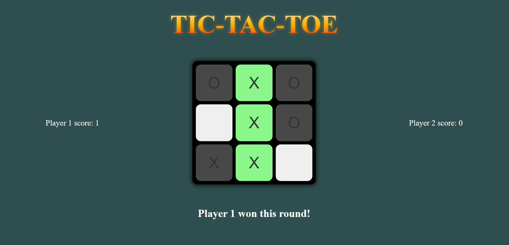

# Jogo da Velha

Um clássico Jogo da Velha construído com JavaScript puro, HTML e CSS. Este projeto foca em uma arquitetura de código limpa, utilizando o Padrão de Módulo (Module Pattern) e Funções de Fábrica (Factory Functions) para separar a lógica do jogo da sua interface de usuário.

[Demonstração ao Vivo](https://moruan06.github.io/Jogo-da-Velha/)  ## Funcionalidades

-   **Contagem de Pontos:** O jogo registra a pontuação para dois jogadores (Jogador 1: X, Jogador 2: O).
-   **Lógica de Partida "Melhor de 3":** O primeiro jogador a vencer 3 rodadas ganha o jogo.
-   **Feedback Visual Claro:** A linha vencedora é destacada em verde e um empate é destacado em amarelo.
-   **Validação de Jogada:** Impede que os jogadores selecionem casas que já estão ocupadas.
-   **Reinicialização Automática:** O tabuleiro é reiniciado automaticamente após cada rodada, e o jogo completo é reiniciado após uma partida ser vencida, permitindo jogar novamente de forma fluida.
-   **Transições de UI Suaves:** Transições limpas entre a tela inicial e a tela de jogo.

## Tecnologias Utilizadas

-   **HTML5:** Para a estrutura do jogo.
-   **CSS3:** Para a estilização e o layout.
-   **JavaScript Puro (ES6+):** Para toda a lógica do jogo, com foco em:
    -   **Padrão de Módulo (IIFEs):** Para encapsular e organizar o código em escopos privados.
    -   **Funções de Fábrica (Factory Functions):** Para criar objetos de jogador reutilizáveis sem o uso de classes.

## Estrutura do Projeto

O código JavaScript é organizado em diversos módulos para garantir uma clara **separação de responsabilidades** (separation of concerns):

-   `gameBoard`: Gerencia apenas o estado interno do array do tabuleiro (os dados).
-   `displayController`: Gerencia todas as interações com o DOM (atualizar a tela, mostrar mensagens, lidar com cliques).
-   `gameController`: Atua como o "cérebro" do jogo, controlando o fluxo, os turnos e as condições de vitória/derrota.
-   `playerFactory`: Uma fábrica para criar objetos de jogador, cada um com seu próprio nome, marcador e pontuação.

## Como Executar

1.  Clone este repositório para a sua máquina local.
2.  Abra o arquivo `index.html` no seu navegador.
3.  Clique em "START" para jogar!

## Agradecimentos

Este projeto foi construído como parte do currículo do [The Odin Project](https://www.theodinproject.com/).
